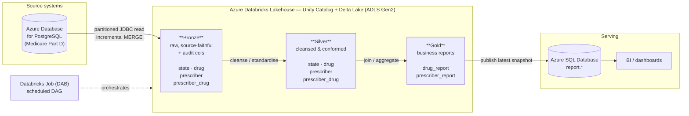
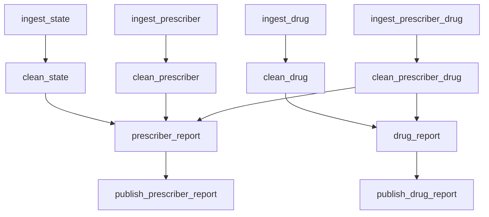

# Architecture

## End-to-end flow

## Task DAG (Databricks Job)

## Data lineage

| Gold table          | Built from (silver)                          | Grain                       |
|---------------------|----------------------------------------------|-----------------------------|
| `drug_report`       | `prescriber_drug` ⨝ `drug`                   | (drug_brand_name, drug)     |
| `prescriber_report` | `prescriber_drug` ⨝ `state` ⨝ `prescriber`   | prescriber × drug claim row |

## Report layouts

**drug_report** — `drug_brand_name`, `drug`, `total_claims`, `total_cost`, `drug_type`

**prescriber_report** — `presc_id`, `presc_fullname`, `presc_specialty`, `presc_state_code`,
`total_claims`, `total_drug_cost`, `state_name`, `presc_type`
